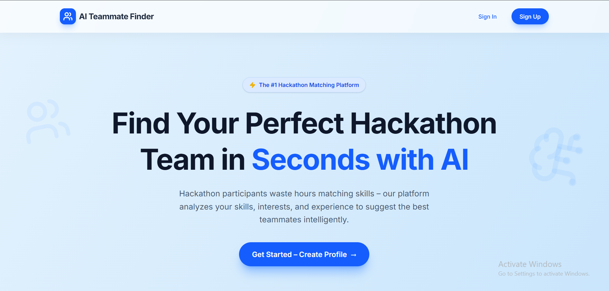
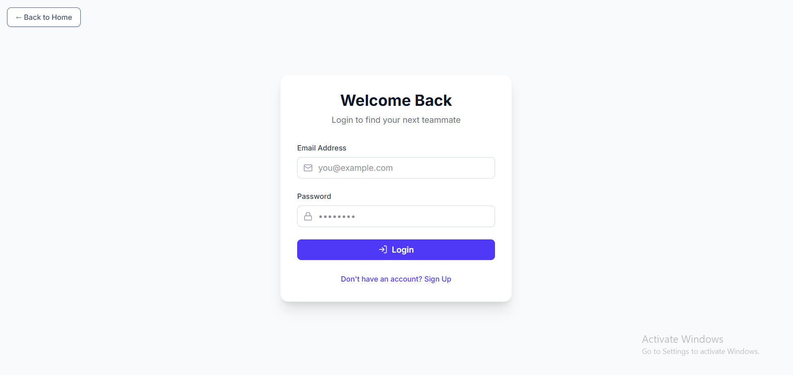
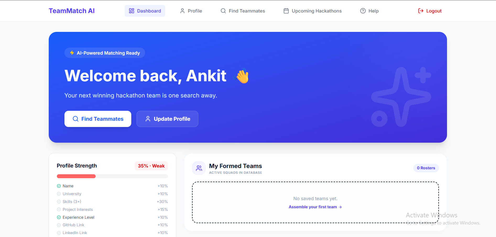
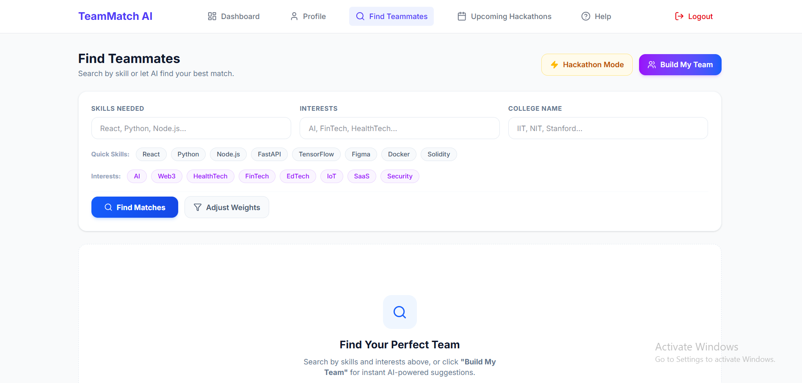
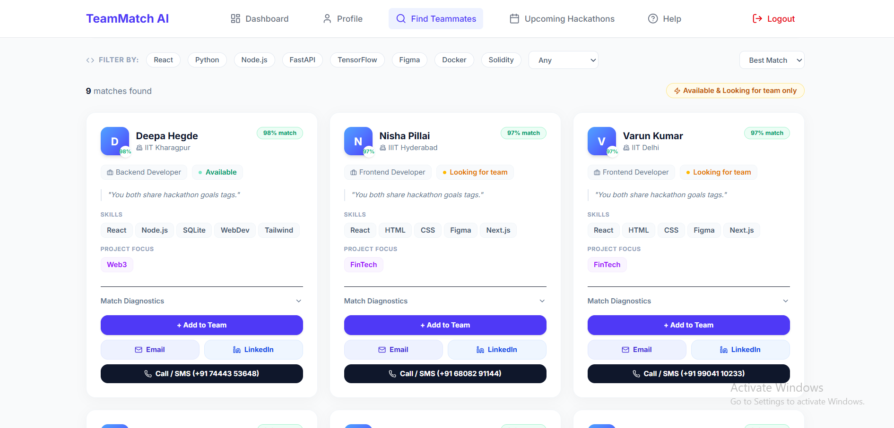
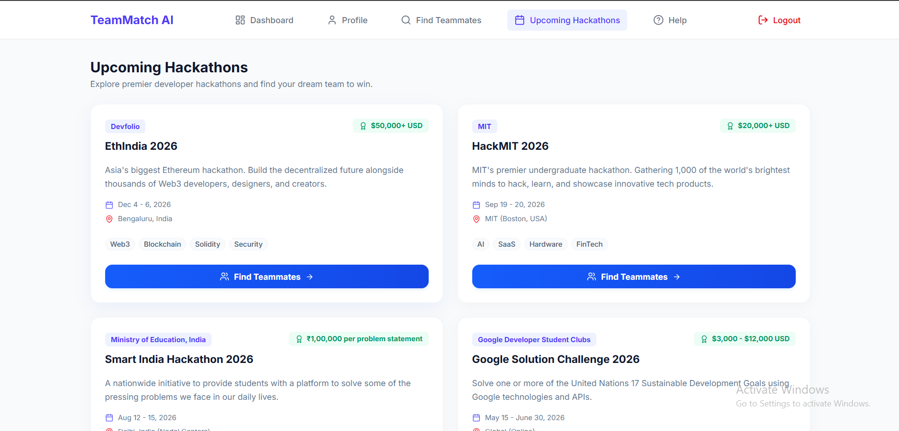

# 🤝 TeamMatch AI

An AI-powered web application that helps students build balanced and compatible hackathon or project teams. TeamMatch AI analyzes users' technical skills, experience, communication ability, and availability using Machine Learning to recommend suitable teammates and evaluate overall team balance.

---

## 🚀 Features

- 🔐 Secure User Authentication using JWT
- 👤 Student Profile Management
- 🤖 AI-Based Teammate Recommendation
- 👥 Team Creation & Management
- 📊 Team Health Analysis
- 🎯 Skill Gap Identification
- 📈 Role Diversity Evaluation
- 💾 Persistent Data Storage using SQLite
- 📱 Modern Responsive React UI

---

## 🧠 Machine Learning

### K-Nearest Neighbors (KNN)

- Recommends the most compatible teammates.
- Considers:
  - DSA
  - Backend
  - Frontend
  - Machine Learning
  - UI/UX
  - Experience
  - Availability
  - Communication
- Uses Cosine Distance to recommend teammates with complementary skill sets.

### K-Means Clustering

Groups students into different technical roles such as:

- AI / ML Developers
- Frontend Developers
- Backend Developers

This helps evaluate whether a team has a balanced distribution of skills.

---

## 🛠 Tech Stack

### Frontend

- React
- Vite
- Tailwind CSS
- Lucide React

### Backend

- Python
- FastAPI
- Uvicorn

### Machine Learning

- Scikit-Learn
- Pandas
- NumPy

### Database

- PostgreSQL

### Authentication

- JWT (JSON Web Token)

---

## 📂 Project Structure

```text
TeamMatch-AI/
│
├── src/                  # React Frontend
├── engine/               # Machine Learning Pipeline
├── data/                 # Dataset & PostgreSQL Database
├── app.py                # FastAPI Server
├── database.py           # Database Operations
├── generate_dataset.py   # Dataset Generation
├── requirements.txt
├── package.json
└── README.md
```

---

## ⚙️ Installation

### 1. Clone the Repository

```bash
git clone <repository-url>
cd TeamMatch-AI
```

### 2. Backend Setup

Create a virtual environment

```bash
python -m venv .venv
```

Activate the virtual environment

**Windows**

```bash
.venv\Scripts\activate
```

**macOS / Linux**

```bash
source .venv/bin/activate
```

Install dependencies

```bash
pip install -r requirements.txt
```

Generate the dataset

```bash
python generate_dataset.py
```

Start the backend server

```bash
python app.py
```

Backend runs at:

```text
http://127.0.0.1:5000
```

---

### 3. Frontend Setup

Install dependencies

```bash
npm install
```

Start the development server

```bash
npm run dev
```

Frontend runs at:

```text
http://localhost:5173
```

---

## 📸 Screenshots

### Home Page



### Login / Signup



### Dashboard



### Find Teammates



### Team Recommendations



### Upcomming Hackathons



---

## 🎯 Future Enhancements

- Real-time team chat
- GitHub profile integration
- Resume-based skill extraction
- Team invitation system
- Project recommendation engine
- Cloud database deployment
- Email notifications
